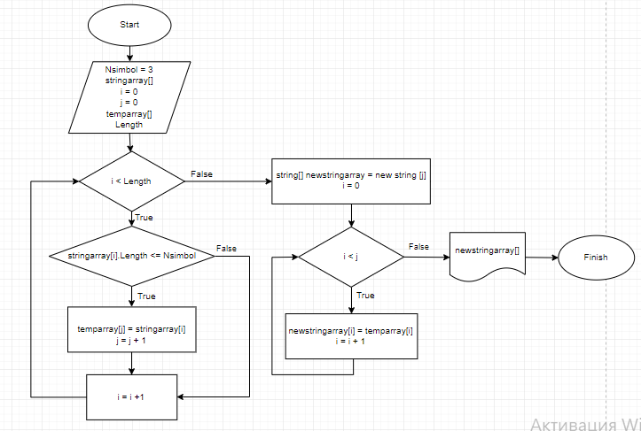

# **Итоговая проверочная работа**
## **Задача.** Написать программу, которая из имеющегося массива строк формирует массив строк, длина которых меньше, либо лавна 3 символа.
### **Решение**
Описание алгоритма:
1. На вход подается массив строк (в представленной программе первоначально заданы 3 массива строк).
2. Далее реализуем метод, который работает с полученным массивом строк.
3. В нём определены следующие переменные:
   *  Количество символов строки для формирования массива (3).
   * Размер массива. На его основе создаётся временный массив строк.
   * Счетчику элементов нового массива (он же будет и размерностью формируемого массива) присваевается начальное значение 0.
4. В цикле от 0 до размерности массива, уменьшенного на 1 происходит проверка каждого элемента на длину строки не больше заданной (3 символа). Удовлетворяющие условию элементы записываются во временный массив, счетчик увеличивается.
5. Если элементов со строками, длина которых удовлетворяет условию не оказалось, выводится соответствующее сообщение или знак "[  ]", если такие элементы нашлись, то создаётся новый массив с размерностью, определенной по счетчику.
6. Из временного массива в цикле формируется окончательный массив, являющийся решением задачи.
7. Для вывода решения на экран используется отдельный метод.
